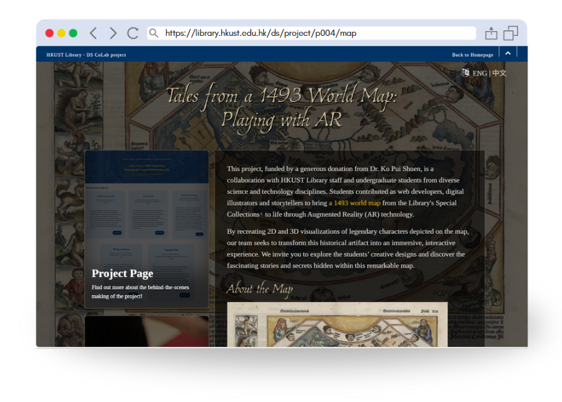

_HKUST Library - DS CoLab Project - P004_
# Tales from a 1493 World Map: Playing with AR

**Project Introduction:**  https://library.hkust.edu.hk/ds/project/p004/  
**Timeframe:** 2024/25 Spring semester (Feb-May 2025)

## Preview

https://library.hkust.edu.hk/ds/project/p004/map

## Main Features

## AR tool used
We used the opensource web augmented reality library [MindAR](https://hiukim.github.io/mind-ar-js-doc/) to create the AR functions in our website.
+ Used [Image Tracking function](https://hiukim.github.io/mind-ar-js-doc/quick-start/overview) for [this page](https://library.hkust.edu.hk/ds/project/p004/map/AR.html)
    + In our case, we compiled our ancient map as targe images using [MindAR's Image Targets Compiler](https://hiukim.github.io/mind-ar-js-doc/tools/compile/), and saved the compiled `.mind` files in `/data/mindTarget`
    + For the data, we input in json files under `/data/AR`
    + The data are then fetched to `AR.html`, `AR_Africa.html`, `AR_Asia.html`, `AR_Europe.html` via `/js/script_AR.js`
+ Used [Face Tracking function](https://hiukim.github.io/mind-ar-js-doc/face-tracking-quick-start/overview) for [this page](https://library.hkust.edu.hk/ds/project/p004/map/FaceDeco.html)
    + data: `/data/FaceDecoration/FaceDecoration_meta.json`
    + js: `/js/scripts_FaceDecoration.js`
    + page: `FaceDeco.html`

## Share with us!
Feel free to look through our source code and adapt it to suit your needs.

If you have any questions or find it helpful, we’d love to hear your thoughts and see your projects too. Feel free to reach out library@ust.hk and share with us! 

Please note that the illustrations and 3D models under the `/images` folder were created by our students and team members, with copyrights belong to the HKUST Library.

## Project Team

| Developers          | Details                                    |
| :------------------ | :----------------------------------------- |
| CHAN Ching, Crystal | Year 4, BEng in Computer Engineering + Minor in Humanities |
| LU Yan, Lucy        | Year 2, BSc in Integrative Systems and Design + Extended Major in Digital Media and Creative Arts  |
| WONG Sze Chai Helen | Year 4, BSc in Biochemistry and Cell Biology (International Research Enrichment Track) |
| YIP Sau Lai, Sherry | Year 4, BSc in Data Science and Technology + Additional major in Computer Science  |
| Zeynep TURK         | Year 2, BEng in Computer Science + Extended Major in Digital Media and Creative Arts  |

| Advisers    | Details                                |
| :---------- | :------------------------------------- |
| Victoria F CAPLAN | Head (Research & Learning Support)  |
| Shirley ZHANG     | Librarian (Archives & Special Collections)  |
| Holly CHAN        | Assistant Manager (Digital Humanities) |
| Amanda MAK        | Officer (Systems & Digital Services) |
| Erin CHAN         | Assistant Officer (Research Support)   |
